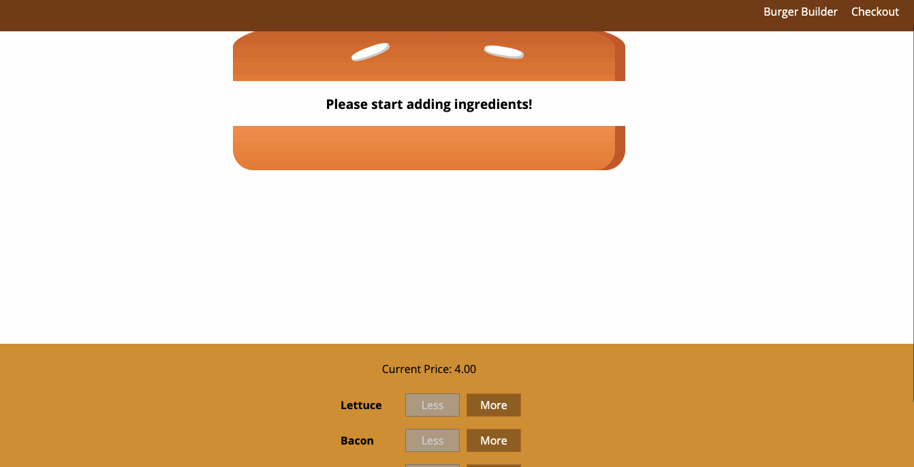

# Build-A-Burger!

## Description

This is a simple build a burger application. User will be able to select different ingredients to add to their burger and in the end will receive a total for their customized burger.

## User Story

    AS A restaurant owner
    I WANT to generate an app that lets users build their burgers
    SO THAT I know what they like to eat on their burgers and they know the total cost of the burger

## Criteria

    GIVEN two buns for the burger

    WHEN the user clicks on the More button for the condiments
    THEN the condiment will be added to the burger on the screen and the price of the burger will increase
    WHEN the user clicks on the Less button
    THEN that condiment will be removed from the burger and the price will decrease
    WHEN the user clicks on the ORDER NOW button
    THEN a screen will appear with the selected ingredients and price of the burger

## Heroku Link

The link below will give you access to the web application via the Heroku web service:

https://ghazi-build-a-burger.herokuapp.com/

## Local Environment Installation

To run the application locally, first clone this repository with the following command:

    https://github.com/dghazi12/davidaghazi13.github.io.git

Next, install the application dependencies:

    npm install

Lastly, start the application server using the command line below:

    npm start or yarn start

## Preview

